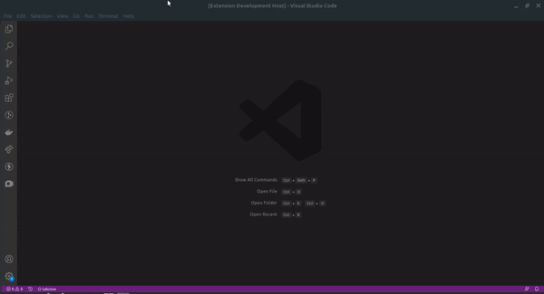

# Google Meet VS Code Extension

This VS Code Extension allows you to start a new Google Meet directly from VS Code by pressing Ctrl+Alt+g.

If Ctrl+Alt+g doesn't work, use Ctrl+Shift+p and type Google Meet

## Features

 / ! 

### 0.0.1

Initial release of Google Meet

### 0.1.0

Icon update

### 0.1.1

Description Update

### 0.1.2

Add support for VS Code version > 1.0.0

### 0.1.3

Add Icon to Activity Bar